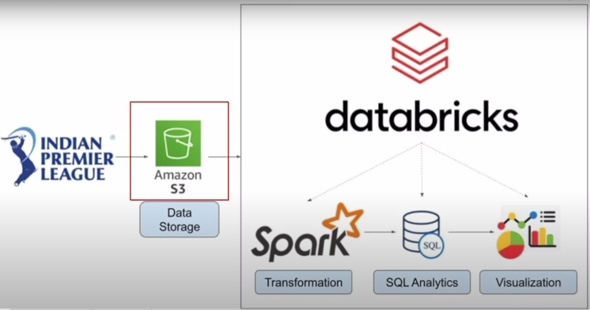

# Data Analytics Pipeline

This document describes a data analytics pipeline built using Databricks and Apache Spark. The pipeline processes data from Amazon S3 and performs data transformation and analytics.

## Architecture

The architecture consists of the following components:

- **Data Source:** Amazon S3 is used to store the raw data.
- **Databricks:** A cloud-based platform for developing and deploying big data processing applications using Apache Spark.
- **Spark:** An open-source framework for large-scale data processing. It performs data ingestion, transformation, and analytics.
- **Transformation and SQL Analytics:** Apache Spark SQL or Spark DataFrames are used to transform the data.
- **Visualization:** Matplotlib can be used to visualize the processed data.

## Technologies Used

- **Apache Spark:** Apache Spark is utilized for its efficient large-scale data processing capabilities.
- **Databricks:** Databricks provides a cloud-based environment for developing and deploying Spark-based applications.
- **Amazon S3:** Amazon S3 serves as the data source for the pipeline, housing the raw data.
- **Spark SQL (or) Spark DataFrames:** Either Spark SQL or Spark DataFrames can be employed for data transformation and analytics, depending on the specific requirements of the project.
- **Visualization tool:** Matplotlib

1. **Data Ingestion:** Raw data is retrieved from Amazon S3.
2. **Data Processing:** Databricks and Apache Spark are utilized to process the data, performing necessary transformations and analytics.
3. **Visualization:** Processed data can be visualized using tools like Matplotlib, providing insights and actionable intelligence.

## Getting Started

To get started with the big data analytics pipeline, follow these steps:

1. Set up an Amazon S3 bucket to store your raw data.
2. Provision a Databricks workspace and configure it to connect to your Amazon S3 bucket.
3. Develop your data processing logic using Apache Spark in Databricks notebooks.
4. Choose between Spark SQL or Spark DataFrames for data transformation and analytics, based on your project requirements.

## Acknowledgments

- [Databricks Documentation](https://docs.databricks.com/)
- [Apache Spark Documentation](https://spark.apache.org/docs/latest/)
- [Amazon S3 Documentation](https://docs.aws.amazon.com/s3/index.html)

